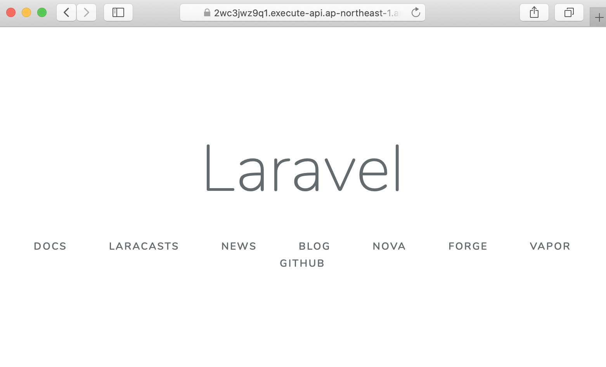

[](https://badge.fury.io/js/cdk-serverless-lamp)
[](https://badge.fury.io/py/cdk-serverless-lamp)


# Welcome to cdk-serverless-lamp

`cdk-serverless-lamp` is a JSII construct library for AWS CDK that allows you to deploy the [New Serverless LAMP Stack](https://aws.amazon.com/tw/blogs/compute/introducing-the-new-serverless-lamp-stack/) running PHP Laravel Apps by specifying the local `laravel` directory.

By deploying the `ServerlessLaravel` and `DatabaseCluster`, the following resources will be created:

1. Amazon API Gateway HTTP API
2. AWS Lambda custom runtime with [Bref runtime](https://bref.sh/docs/runtimes/) support
3. Amazon Aurora for MySQL database cluster with RDS proxy enabled

## Howto

Create a new Laravel project with AWS CDK

```sh
$ mkdir serverless-lamp && cd serverless-lamp
# create cdk and codebase directories for AWS CDK and Laravel project
$ mkdir cdk codebase
# create the new Laravel project with docker
$ docker run --rm -ti \
  --volume $PWD:/app \
  composer create-project --prefer-dist laravel/laravel ./codebase
# install bref/bref and bref/laravel-bridge in the vendor
$ code codebase
$ docker run --rm -ti \
  --volume $PWD:/app \
  composer require bref/bref bref/laravel-bridge
# initialize the AWS CDK project
$ cd ../cdk
$ cdk init -l typescript
# install the cdk-severless-lamp npm module
$ yarn add cdk-serverless-lamp
```

Now your directories should look like this:

```
.
├── cdk
└── codebase
```
where `cdk` is for the AWS CDK and `codebase` for Laravel project.

# AWS CDK sample

Building your serverless Laravel with `ServerlessLaravel` construct:

Update `./cdk/lib/cdk-stack.ts`

```ts
import * as cdk from '@aws-cdk/core';
import * as path from 'path';
import { ServerlessLaravel } from 'cdk-serverless-lamp';

export class CdkStack extends cdk.Stack {
  constructor(scope: cdk.Construct, id: string, props?: cdk.StackProps) {
    super(scope, id, props);

    new ServerlessLaravel(this, 'ServerlessLaravel', {
      brefLayerVersion: 'arn:aws:lambda:us-east-1:209497400698:layer:php-74-fpm:12',
      laravelPath: path.join(__dirname, '../../codebase'),
    });
  }
}
```

deploy the CDK stack:

```sh
# see the difference before the deployment
$ cdk diff
# deploy it
$ cdk deploy
```


On deploy complete, the API Gateway URL will be returned in the Output. Click the URL and you will see the Laravel landing page:




## Amazon Aurora support

Use `DatabaseCluster` to create the your database cluster:

```ts
import * as cdk from '@aws-cdk/core';
import { InstanceType, Vpc } from '@aws-cdk/aws-ec2';
import * as path from 'path';
import { ServerlessLaravel, DatabaseCluster } from 'cdk-serverless-lamp';

export class CdkStack extends cdk.Stack {
  constructor(scope: cdk.Construct, id: string, props?: cdk.StackProps) {
    super(scope, id, props);

    const vpc = new Vpc(this, 'Vpc',{ maxAzs: 3, natGateways: 1 } )

    // the DatabaseCluster sharing the same vpc with the ServerlessLaravel
    const db = new DatabaseCluster(this, 'DatabaseCluster', {
      vpc,
      instanceType: new InstanceType('t3.small'),
      rdsProxy: true,
    })

    // the ServerlessLaravel
    new ServerlessLaravel(this, 'ServerlessLaravel', {
      brefLayerVersion: 'arn:aws:lambda:us-east-1:209497400698:layer:php-74-fpm:12',
      laravelPath: path.join(__dirname, '../../codebase'),
      vpc, 
      databaseConfig: {
        writerEndpoint: db.rdsProxy!.endpoint,
      },
    });
  }
}
 ```


## Local Development

Create `docker-compose.yml` with the following content:

```docker-compose
version: "3.5"
services:
  web:
    image: bref/fpm-dev-gateway
    ports:
      - "8000:80"
    volumes:
      - ./laravel:/var/task
    depends_on:
      - php
    environment:
      HANDLER: public/index.php
  php:
    image: bref/php-74-fpm-dev
    volumes:
      - ./laravel:/var/task
```

and run this command `docker-compose up -d` and now you can access <http://localhost:8000>.

_(more information can be found in [bref documentation](https://bref.sh/docs/local-development.html))_
